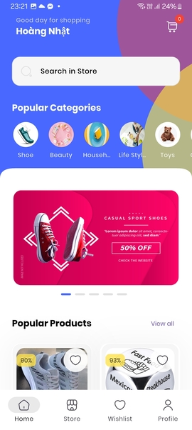
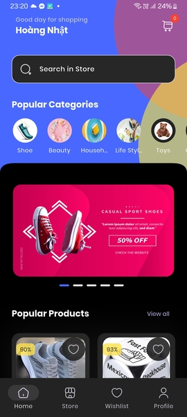
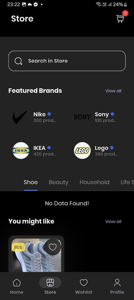
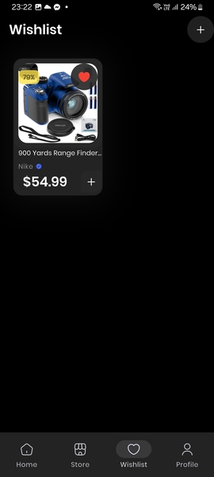
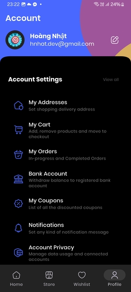
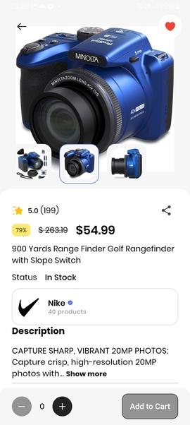
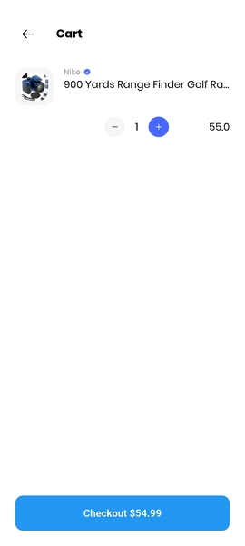

# e_commerce_app

E-commerce Mobile Application

A full-stack e-commerce application built with Flutter and Node.js, featuring complex payment
gateway integrations and automated logistics.

## Screenshots

|  |  |  |  |  |  |  |  |
| :---: | :---: | :---: | :---: | :---: | :---: | :---: | :---: | :---: | :---: | :---: |

✨ Key Features

The application implements a scalable e-commerce solution built on a Feature-Based Architecture and
GetX for reactive state management. Key functionality includes robust, end-to-end transaction
processing by integrating with PayPal (handling OAuth 2.0 and Capture flows). ensuring
efficient service and a clean separation of concerns.

🛠️ Tech Stack & Architecture
| **Mobile Framework** | Flutter (Dart) |

| **State Management** |GetX  |

| **Backend / API** | Node.js |

| **Database & Auth** | Firebase (Cloud Storage) |

| **Payments & Security** | PayPal REST API |

| **Cloud Services** | Cloudinary |

## 🚀 Getting Started

1.  **Clone Repository:**
    ```bash
    git clone https://github.com/1heroflutter/e-commerce
    ```
2.  **Firebase Setup:** Create a new Firebase project and place the generated `google-services.json` file into the `app/` directory. Enable **Authentication** and **Cloud Firestore** services.
3.  **Open Project:** Open the project using Android Studio/Visual Studio Code (latest version recommended),.
4.  **Build & Run:** Run the application on an emulator or a physical device.
